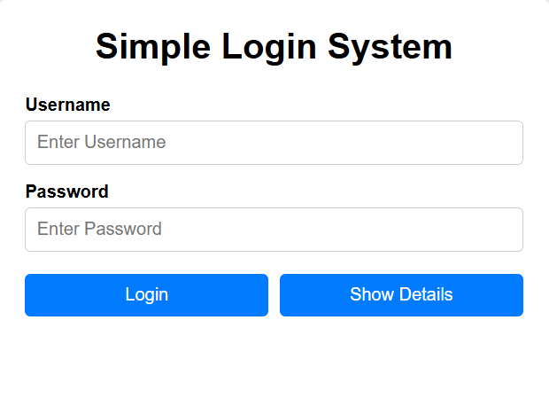
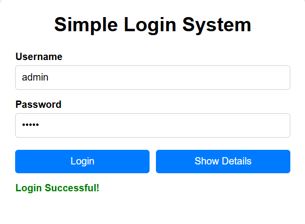
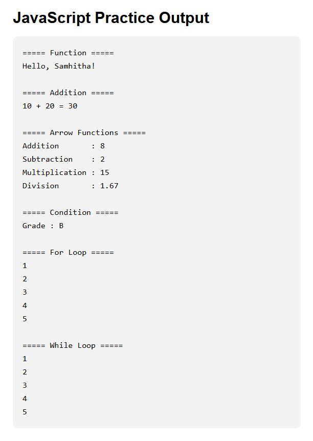

# 📅 Day 1 – HTML, CSS & JavaScript Basics

## 📌 Overview

This folder contains my **Day 1** work from the **Full Stack Development Workshop**.

The workshop introduced the fundamentals of **HTML, CSS, and JavaScript** through simple examples. To reinforce my understanding, I analyzed the original workshop files, improved the code using better project structure, and documented the concepts I learned.

The final improved project is a **Simple Login System** that demonstrates basic web development concepts and JavaScript programming.

---

## 🎯 Learning Objectives

- Understand the purpose of HTML, CSS, and JavaScript.
- Learn the structure of an HTML5 document.
- Create forms using HTML.
- Style webpages using CSS.
- Access HTML elements using the DOM.
- Read user input using `.value`.
- Validate user input using conditional statements.
- Display dynamic content using JavaScript.
- Organize a small web project using separate HTML, CSS, and JavaScript files.

---

## 🛠️ Technologies Used

- HTML5
- CSS3
- JavaScript (ES6)

---

## 📂 Folder Structure

```text
Day-01_HTML_CSS_JS
│
├── Original-Code
│   ├── p2.html
│   ├── pg2.html
│   └── p1.js
│
├── Improved-Code
│   ├── index.html
│   ├── style.css
│   └── script.js
│
├── Practice
│
├── Notes.md
│
└── README.md
```

---

## ✨ Project Features

The improved project includes:

- Login form
- Username and password validation
- Empty field validation
- Display entered user details
- Password masking using `*`
- DOM manipulation
- JavaScript practice examples
- Functions
- Arrow functions
- Conditional statements
- `for` and `while` loops
- External CSS and JavaScript files

---

## 📸 Project Preview

### Login Page



### Successful Login



### JavaScript Output



---

## 🚀 How to Run

1. Open the `Improved-Code` folder.
2. Open `index.html` in your web browser.
3. Enter a username and password.
4. Click **Login** or **Show Details** to test the application.

---

## 📚 Concepts Covered

### HTML

- HTML5 document structure
- Headings
- Labels
- Input elements
- Buttons
- Paragraphs
- `id`
- `placeholder`

### CSS

- Selectors
- Colors
- Typography
- Box Model
- Flexbox
- Hover effects
- Responsive layout

### JavaScript

- Variables
- Functions
- Arrow functions
- DOM manipulation
- `document.getElementById()`
- `.value`
- `.textContent`
- `addEventListener()`
- Template literals
- `if`, `else if`, `else`
- `for` loop
- `while` loop

---

## 🚀 Improvements Made

Compared to the original workshop code:

- Reorganized the project into separate HTML, CSS, and JavaScript files.
- Improved code readability with comments.
- Added proper form validation.
- Added password masking.
- Enhanced the user interface using CSS.
- Organized JavaScript into logical sections.
- Followed a cleaner project structure.

---

## 🎓 Learning Outcomes

After completing Day 1, I can:

- Build a basic web page.
- Create HTML forms.
- Style webpages with CSS.
- Access and modify HTML elements using JavaScript.
- Validate user input.
- Write reusable functions.
- Use loops and conditional statements.
- Organize a beginner-friendly web project.

---
## 📌 Next Steps

- Continue to Day 2 of the workshop.
- Build more interactive web pages.
- Learn advanced DOM manipulation.
- Improve UI with additional CSS techniques.

---

## 📖 Notes

Detailed explanations of every concept covered on Day 1 are available in [Notes.md](Notes.md).

---

## 📊 Day 1 Summary

| Category | Status |
|----------|--------|
| Original Workshop Code | ✅ Reviewed |
| Improved Code | ✅ Completed |
| Practice Exercises | ✅ Completed |
| Notes | ✅ Completed |
| Documentation | ✅ Completed |
| GitHub Upload | ✅ Completed |

---

## ✅ Status

**Day 1 Completed Successfully** 🎉