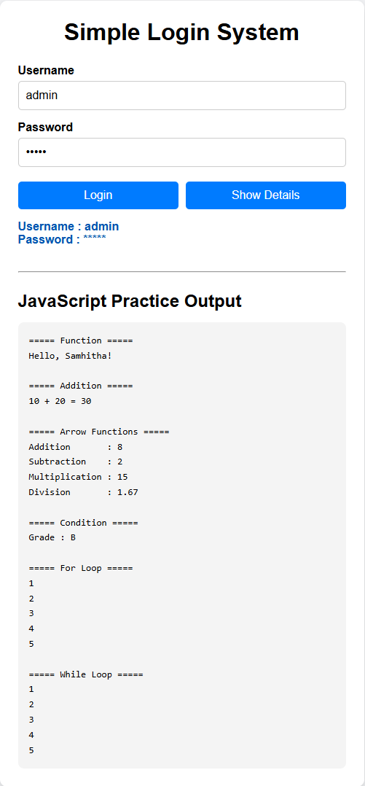
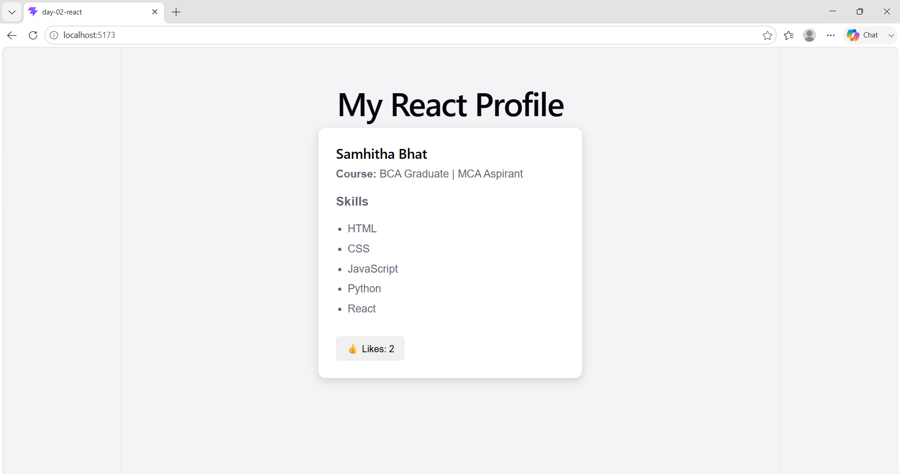

# 🚀 Full Stack Development Workshop

This repository documents my learning journey through a **5-Day Full Stack Development Workshop**. Instead of simply uploading the workshop files, I analyze each concept, improve the code using best practices, document my learning, and build additional practice exercises.

The goal of this repository is to strengthen my understanding of full stack development while creating a well-organized portfolio for future placements and interviews.

---

## 📸 Repository Preview

### Day 1 – Simple Login System



### Day 2 – React Profile Application



---

## 🎯 Objectives

* Learn Full Stack Development fundamentals.
* Understand every concept taught in the workshop.
* Improve the original workshop code.
* Follow professional project structure.
* Practice Git and GitHub workflows.
* Build a strong learning portfolio.

---

## 🛠️ Technologies

### Frontend

* HTML5
* CSS3
* JavaScript (ES6)
* React
* JSX

### Development Tools

* Vite
* npm
* Visual Studio Code
* Git
* GitHub

---

# 📂 Repository Structure

```text
Full-Stack-Development-Workshop
│
├── Assets
│   ├── Day-01
│   │   ├── login-page.png
│   │   ├── login-success.png
│   │   └── javascript-output.png
│   │
│   ├── Day-02
│   │   └── react-profile.png
│   │
│   ├── Day-03
│   │
│   ├── Day-04
│   │
│   ├── Day-05
│   │
│   └── repository-banner.png   (Optional)
│
├── Certificate
│
├── Day-01_HTML_CSS_JS
│   ├── Original-Code
│   ├── Improved-Code
│   ├── Practice
│   ├── Notes.md
│   └── README.md
│
├── Day-02_React
│   ├── public
│   ├── src
│   ├── index.html
│   ├── Notes.md
│   ├── package.json
│   ├── package-lock.json
│   ├── README.md
│   └── vite.config.js
│
├── Day-03
├── Day-04
├── Day-05
│
└── README.md
```

---

## 📚 Workshop Modules

| Day   | Folder                                    | Topic                         | Status      |
| ----- | ----------------------------------------- | ----------------------------- | ----------- |
| Day 1 | [Day-01_HTML_CSS_JS](Day-01_HTML_CSS_JS/) | HTML, CSS & JavaScript Basics | ✅ Completed |
| Day 2 | [Day-02_React](Day-02_React/)             | React Fundamentals            | ✅ Completed |
| Day 3 | Day-03                                    | Coming Soon                   | ⏳           |
| Day 4 | Day-04                                    | Coming Soon                   | ⏳           |
| Day 5 | Day-05                                    | Coming Soon                   | ⏳           |

---

# 📚 Workshop Progress

| Day   | Topic                         | Status      |
| ----- | ----------------------------- | ----------- |
| Day 1 | HTML, CSS & JavaScript Basics | ✅ Completed |
| Day 2 | React Fundamentals            | ✅ Completed |
| Day 3 | Coming Soon                   | ⏳           |
| Day 4 | Coming Soon                   | ⏳           |
| Day 5 | Coming Soon                   | ⏳           |

---

# 📖 Learning Approach

For every workshop day, I follow the same workflow:

1. Study the original workshop code.
2. Understand every concept.
3. Improve the code using best practices.
4. Document important concepts.
5. Build additional practice exercises.
6. Commit and push the completed work to GitHub.

---

# 🌟 Repository Highlights

* Well-organized folder structure
* Original workshop source code
* Improved implementations
* React practice project
* Detailed notes
* Practice exercises
* Git commit history
* Project screenshots
* Interview preparation material

---

# 🎓 Learning Outcomes

Through this workshop, I aim to:

* Build a strong foundation in Full Stack Development.
* Understand frontend development fundamentals.
* Learn how React applications are structured.
* Improve problem-solving skills.
* Write clean and maintainable code.
* Understand modern web development practices.
* Prepare for internships and placement opportunities.

---

# 📌 Future Enhancements

* Complete the remaining workshop modules.
* Responsive web design
* Additional React practice projects
* Additional JavaScript practice
* Mini full stack applications
* Deployment using GitHub Pages (where applicable)
* Interview question collection
* Project screenshots
* Improved documentation for each workshop day

---

# 👩‍💻 About Me

**Samhitha Bhat**

* BCA Graduate
* MCA Aspirant
* Python Developer
* Web Development Enthusiast

### Connect with me

* **GitHub:** [https://github.com/SamhithaBhatN](https://github.com/SamhithaBhatN)
* **LinkedIn:** [https://www.linkedin.com/in/samhithabhat31](https://www.linkedin.com/in/samhithabhat31)

---

⭐ *This repository is continuously updated as I progress through the workshop and deepen my understanding of Full Stack Development.*