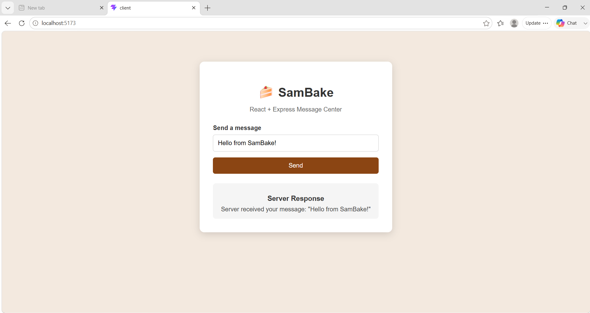

````markdown
# 🚀 Full Stack Development Workshop

This repository documents my learning journey through a **5-Day Full Stack Development Workshop**.

Instead of simply uploading the workshop files, I analyze each concept, improve the code using best practices, document my learning, and build additional practice exercises.

The goal of this repository is to strengthen my understanding of full stack development while creating a well-organized portfolio for future internships, placements, and interviews.

---

## 📸 Repository Preview

### Day 1 – Simple Login System


### Day 2 – React Profile Application


### Day 3 – React + Express Message Center



### Day 4 – MongoDB

Day 4 focused on MongoDB, MongoDB Atlas, database connectivity, collections, documents, and REST API integration.

### Day 5 – Full-Stack User Management

Day 5 completed the workshop by connecting a frontend, Express.js backend, REST API, and MongoDB database into a complete CRUD application.

---

## 🎯 Objectives

- Learn Full Stack Development fundamentals.
- Understand every concept taught in the workshop.
- Improve the original workshop code.
- Follow a professional project structure.
- Practice Git and GitHub workflows.
- Build a strong learning portfolio.
- Understand frontend and backend communication.
- Work with REST APIs.
- Understand database integration.
- Practice CRUD operations.
- Document practical learning and project progress.

---

## 🛠️ Technologies

### Frontend

- HTML5
- CSS3
- JavaScript (ES6)
- React
- JSX
- Fetch API

### Backend

- Node.js
- Express.js
- CORS

### Database

- MongoDB
- MongoDB Atlas
- MongoDB Node.js Driver

### Development Tools

- Postman
- MongoDB Compass
- Vite
- npm
- Visual Studio Code
- Git
- GitHub
- dotenv

---

# 📂 Repository Structure

```text
Full-Stack-Development-Workshop/
│
├── Assets/
│   ├── Day-01/
│   ├── Day-02/
│   ├── Day-03/
│   ├── Day-04/
│   ├── Day-05/
│   └── repository-banner.png
│
├── Certificate/
│
├── Day-01_HTML_CSS_JS/
│   ├── Original-Code/
│   ├── Improved-Code/
│   ├── Practice/
│   ├── Notes.md
│   └── README.md
│
├── Day-02_React/
│   ├── public/
│   ├── src/
│   ├── index.html
│   ├── Notes.md
│   ├── package.json
│   ├── package-lock.json
│   ├── README.md
│   └── vite.config.js
│
├── Day-03_Express/
│   ├── client/
│   ├── server/
│   ├── Notes.md
│   └── README.md
│
├── Day-04_MongoDB/
│   ├── server/
│   │   ├── models/
│   │   │   └── User.js
│   │   ├── .gitignore
│   │   ├── index.js
│   │   ├── package.json
│   │   └── package-lock.json
│   ├── Notes.md
│   └── README.md
│
├── Day-05_FullStack/
│   ├── public/
│   │   ├── index.html
│   │   ├── style.css
│   │   └── script.js
│   ├── .gitignore
│   ├── package.json
│   ├── package-lock.json
│   ├── server.js
│   ├── README.md
│   └── Notes.md
│
└── README.md
````

> `node_modules/` exists locally inside project folders but is excluded from Git using `.gitignore`.

> `.env` files are kept locally and should never be committed to GitHub.

---

# 📚 Workshop Modules

| Day   | Folder                                    | Topic                                       | Status      |
| ----- | ----------------------------------------- | ------------------------------------------- | ----------- |
| Day 1 | [Day-01_HTML_CSS_JS](Day-01_HTML_CSS_JS/) | HTML, CSS & JavaScript Basics               | ✅ Completed |
| Day 2 | [Day-02_React](Day-02_React/)             | React Fundamentals                          | ✅ Completed |
| Day 3 | [Day-03_Express](Day-03_Express/)         | React + Express & API Communication         | ✅ Completed |
| Day 4 | [Day-04_MongoDB](Day-04_MongoDB/)         | MongoDB & REST API Integration              | ✅ Completed |
| Day 5 | [Day-05_FullStack](Day-05_FullStack/)     | Full-Stack User Management CRUD Application | ✅ Completed |

---

# 📊 Workshop Progress

| Day   | Topic                                         | Status      |
| ----- | --------------------------------------------- | ----------- |
| Day 1 | HTML, CSS & JavaScript Basics                 | ✅ Completed |
| Day 2 | React Fundamentals                            | ✅ Completed |
| Day 3 | React + Express & API Communication           | ✅ Completed |
| Day 4 | MongoDB & REST API Integration                | ✅ Completed |
| Day 5 | Express + MongoDB Full-Stack CRUD Application | ✅ Completed |

---

# 📖 Learning Approach

For every workshop day, I follow the same workflow:

1. Study the original workshop code.
2. Understand the concepts.
3. Improve the code using best practices.
4. Document important concepts.
5. Build additional practice exercises.
6. Test the completed project.
7. Commit and push the completed work to GitHub.

---

# 🌟 Repository Highlights

* Well-organized folder structure
* Original workshop source code
* Improved implementations
* HTML, CSS and JavaScript practice
* React practice projects
* Express backend practice
* MongoDB database integration
* REST API implementation
* CRUD operations
* Frontend-backend communication
* Fetch API usage
* Postman API testing
* Detailed learning notes
* Practice exercises
* Git commit history
* Project screenshots
* Interview preparation material

---

# 🎓 Learning Outcomes

Through this workshop, I learned how to:

* Build frontend applications using HTML, CSS and JavaScript.
* Understand React fundamentals.
* Create reusable React components.
* Manage React state and events.
* Build Express.js servers.
* Create REST API endpoints.
* Communicate between frontend and backend.
* Work with JSON request and response data.
* Use the Fetch API.
* Configure CORS.
* Connect Node.js applications to MongoDB.
* Work with MongoDB databases and collections.
* Use MongoDB Atlas.
* Perform CRUD operations.
* Work with MongoDB `ObjectId`.
* Use environment variables with `dotenv`.
* Test APIs using Postman.
* Handle basic backend and frontend errors.
* Build a complete frontend → backend → database application flow.
* Organize projects using a professional development workflow.
* Use Git and GitHub for version control.

---

# 🗺️ Current Progress

## ✅ Day 1 – HTML, CSS & JavaScript

Learned the fundamentals of:

* HTML structure
* CSS styling
* JavaScript basics
* Variables and data types
* Conditions
* Loops
* Functions
* Form handling
* Basic client-side interaction

---

## ✅ Day 2 – React

Learned the fundamentals of:

* React
* JSX
* Components
* Props
* State
* Event handling
* `useState`
* Vite
* Basic React application structure

---

## ✅ Day 3 – React + Express

Learned how to:

* Create an Express server.
* Create API endpoints.
* Send requests from React.
* Receive responses from Express.
* Exchange JSON data.
* Use `fetch()`.
* Configure CORS.
* Connect frontend and backend.

---

## ✅ Day 4 – MongoDB

Learned how to:

* Create and configure a MongoDB Atlas database.
* Configure database access.
* Configure network access.
* Connect a Node.js application to MongoDB.
* Work with databases and collections.
* Store documents in MongoDB.
* Retrieve documents from MongoDB.
* Integrate MongoDB with REST APIs.
* Test database-related APIs using Postman.
* Use `.env` for sensitive configuration.

---

## ✅ Day 5 – Full-Stack User Management

Built a complete **Express.js + MongoDB CRUD application**.

The application includes:

* HTML frontend
* CSS styling
* JavaScript frontend logic
* Express.js backend
* MongoDB database
* MongoDB Node.js Driver
* REST API
* Create operation
* Read operation
* Update operation
* Delete operation
* Fetch API communication
* Dynamic user display
* Environment variables
* Error handling
* Postman API testing

The user data contains:

```text
Name
Email
Course
```

The application provides the following API endpoints:

```text
POST   /users
GET    /users
GET    /users/:id
PUT    /users/:id
DELETE /users/:id
```

---

# 🔄 Full-Stack Application Architecture

The final Day 5 application follows this architecture:

```text
┌──────────────────────┐
│      Frontend        │
│   HTML + CSS + JS    │
└──────────┬───────────┘
           │
           │ Fetch API
           ▼
┌──────────────────────┐
│     Express.js       │
│      REST API        │
└──────────┬───────────┘
           │
           │ MongoDB Driver
           ▼
┌──────────────────────┐
│       MongoDB        │
│  Day05FullStack DB   │
│       users          │
└──────────────────────┘
```

---

# 📌 Day 5 CRUD Operations

| Operation | HTTP Method | Endpoint     | Purpose            |
| --------- | ----------- | ------------ | ------------------ |
| Create    | POST        | `/users`     | Add a new user     |
| Read      | GET         | `/users`     | Retrieve all users |
| Read      | GET         | `/users/:id` | Retrieve one user  |
| Update    | PUT         | `/users/:id` | Update a user      |
| Delete    | DELETE      | `/users/:id` | Delete a user      |

---

# 🔐 Security Practices

Sensitive configuration is kept outside the source code.

The Day 5 project uses:

```text
.env
```

for the MongoDB connection string and server configuration.

The `.gitignore` file contains:

```text
node_modules/
.env
```

This prevents:

* `node_modules/` from being committed.
* MongoDB credentials from being exposed.
* Environment-specific configuration from being uploaded.

---

# 📌 Important Day 5 Concepts

The most important concepts learned in the final module include:

```text
Node.js
    ↓
Express.js
    ↓
Middleware
    ↓
REST API
    ↓
MongoDB Driver
    ↓
MongoDB
    ↓
JSON Response
    ↓
Fetch API
    ↓
Frontend UI
```

This completed the basic full-stack development cycle covered in the workshop.

---

# 📌 Future Enhancements

Although the 5-Day workshop is complete, this repository can continue to grow.

Possible future improvements include:

* Add Edit and Delete buttons directly to the Day 5 frontend.
* Add frontend form validation.
* Add loading indicators.
* Improve error messages.
* Improve responsive design.
* Add search functionality.
* Add pagination.
* Add authentication and authorization.
* Add JWT authentication.
* Add password hashing.
* Explore Express Router.
* Explore MVC architecture.
* Build larger MongoDB applications.
* Deploy full-stack applications.
* Add more React + Express + MongoDB projects.
* Add interview preparation material.

---

# 👩‍💻 About Me

**Samhitha Bhat**

* BCA Graduate
* MCA Aspirant
* Python Developer
* Web Development Enthusiast
* Full-Stack Development Learner

### Connect with me

* **GitHub:** [https://github.com/SamhithaBhatN](https://github.com/SamhithaBhatN)
* **LinkedIn:** [https://www.linkedin.com/in/samhithabhat31](https://www.linkedin.com/in/samhithabhat31)

---

# 🎉 Workshop Completed

All five modules of the Full Stack Development Workshop have been completed.

```text
Day 1
HTML + CSS + JavaScript
        ↓
Day 2
React
        ↓
Day 3
React + Express
        ↓
Day 4
MongoDB
        ↓
Day 5
Express + MongoDB + CRUD
        ↓
Complete Full-Stack Application
```

This workshop strengthened my understanding of how different technologies work together to build modern web applications.

---

⭐ *This repository is continuously updated as I continue learning, practicing, and building Full Stack Development projects.*

```
```